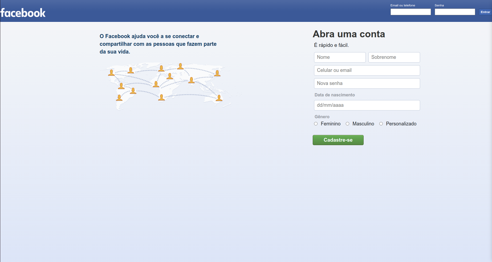

<div>
  <a href="README.md">🇺🇸 English</a> |
  <a href="README.pt.md">🇧🇷 Portuguese</a>
</div>

<h1 align="center">
  <br/>
    Facebook SignUp
</h1>

<p align="center">
  
</p>

<h2 align="center">
  <a href="#funcionalidades">Funcionalidades</a> •
  <a href="#como-usar">Como Usar</a> •
  <a href="#contribuição">Contribuição</a> •
  <a href="#licença">Licença</a>
</h2>

---

## Visão Geral Básica

Este projeto é um clone da página de login do antigo Facebook, desenvolvido usando CSS3, HTML5 e JavaScript. O objetivo é recriar a aparência e funcionalidade da antiga página de login do Facebook.



O projeto está hospedado no GitHub Pages e pode ser acessado através do seguinte link: https://cleytonoliveira.github.io/facebook-signup/

## Funcionalidades

O projeto inclui as seguintes funcionalidades:

- Captura do email ou número de telefone do usuário ao clicar no botão de login.
- Validação dos campos do formulário de registro antes de enviar os dados.
- Opção de selecionar um gênero personalizado, se desejado.
- Exibição das informações de registro após a validação do formulário.

## Como Usar

1. Clone este repositório em sua máquina local:

```bash
git clone git@github.com:cleytonoliveira/facebook-signup.git
```

2. Navegue até o diretório do projeto:

```bash
cd facebook-signup
```

3. Abra o arquivo `index.html` em seu navegador da web.

4. Agora você deverá ver a antiga página de login do Facebook sendo exibida.

## Contribuição

Obrigado por considerar contribuir para este projeto! Para contribuir, siga estes passos:

1. Faça um fork do repositório do projeto.
2. Crie um novo branch para sua contribuição.
3. Faça as alterações ou adições necessárias.
4. Teste suas alterações minuciosamente.
5. Faça commits das suas alterações com mensagens descritivas.
6. Faça push das suas alterações para o repositório forked.
7. Envie uma solicitação de pull para o repositório principal.

Por favor, certifique-se de que seu código siga as normas de codificação do projeto e siga as diretrizes estabelecidas.

## Licença

Este projeto está licenciado sob a [Licença MIT](LICENSE).
